# LLVM-IR → ARM-binary fault-leakage translation (Dilithium / ML-DSA-44)

How many of the `Dilithium-LLVM` IR-level fault findings reproduce on the **ARM binary**
via this platform's `funcskip` instruction-skip + detector repertoire.

- **LLVM** has two IR-fault tests: *ineffective* (SIFA-style no-op faults) and *correction*
  (output-changing faults). Numbers (detected/total) are transcribed from the project's summary image.
- **ARM** (n=40/key): *leak* = `per_coord`/TVLA sites flagged LEAK at FDR≤0.01 (the correction
  analog); *φIF* = number of skip sites that are **key-dependent ineffective** (defined below).
- Fault models differ (IR bit/value faults vs whole-instruction skip), and funcskip captures
  only functions **reached during signing**, so this is a *translation* study, not 1:1.

The **ineffective test is φIF** -- a *key-dependent* ineffective fault: ∃ public `p`, ∃ secrets
`s1,s2` where the same skip is ineffective for `s1` (Δ=0) but effective for `s2` (Δ≠0). On ARM
we test it per skip site with A and B signing the **same message + RNG** (only `sk` differs):
a site is **φIF** if, for some message, skipping is a no-op for one key but changes the output
for the other. (`correction` stays the leak axis = `per_coord`/TVLA LEAK.)

## Aggregate translation rate (reachable functions with an ARM dump)

- **Correction → ARM leak:** 1/8 of LLVM-correction-flagged functions also leak on ARM (the ARM leakers: `polyvecl_add`).
- **Ineffective (φIF) → ARM φIF:** 1/10 of LLVM-ineffective-flagged functions have a **key-dependent ineffective** site on ARM.
- Across all 21 reachable functions: **4** have ≥1 φIF site (**71** key-dependent-ineffective sites in total): `ntt`(63), `poly_challenge`(5), `polyvecl_uniform_gamma1`(2), `poly_chknorm`(1).

## Takeaways

- Under whole-instruction skip, the ARM binary leaks the key (correction axis) at essentially **one** place -- the mask add `polyvecl_add` (`z = z + y`), the canonical Exploiting-Determinism fault -- while every other reachable function shows **0** leaking sites. LLVM's value-level correction faults translate **poorly** to instruction-skip key leakage (a skip is a coarser fault than an IR bit/value corruption).
- **φIF (key-dependent ineffective -- SIFA *candidate* surface):** 71 such sites across 4 functions. These are skip points where the no-op/effective status differs between keys A and B. Caveat: A and B each run a full signing, so they also feed *different inputs* to the faulted function (different `c̃`, `μ`) -- a flip conflates genuine key-dependence with ordinary input-dependence, so this *locates candidate sites* rather than proving SIFA-exploitability. Publicness of the driving value does NOT rule a site out (SIFA exploits an ineffective-conditioned *bias*, which can arise even for public operands); deciding each site needs the SIFA test proper (fix the key, fault across many inputs, filter to the ineffective subset, test the conditional bias). The signal is heaviest in the NTT butterflies.
- The m4f optimising compiler **inlines 8 of the reference functions out of the signing path** (`polyveck_add/sub/chknorm/make_hint`, the `c·s` `*_pointwise_poly_montgomery` multiplies, `polyvecl_invntt_tomont`/`pointwise_acc`), so the ARM fault surface is **smaller** than the IR the LLVM tool analysed -- compilation itself changes what can be faulted.

The two axes below come from **two different detectors** -- do not conflate them:

- **(A) distribution-difference** (`per_coord`/TVLA): the faulted *output distribution* differs by key
  (the *correction* analog -- a key LEAK).
- **(B) ineffective / φIF**: whether the skip is a *no-op* differs by key (the LLVM *ineffective* test).
  This is NOT a distribution test -- a site can be φIF with |t| at the no-leak floor, and vice-versa.

## (A) Distribution-difference detector -- where the output leaks by key (per_coord / TVLA)

**`polyvecl_add`** -- 5 LEAK site(s) (max\|t\|=16.9):

| addr | max\|t\| | instruction |
|---|---|---|
| `0x46d2` | 16.9 | `mov r7, r0` |
| `0x46dc` | 4.6 | `adds r1, r6, r4` |
| `0x46e4` | 16.9 | `bl #0x3d94` |
| `0x46e8` | 16.9 | `cmp.w r4, #0x1000` |
| `0x46ec` | 16.9 | `bne #0x46da` |

`polyvecl_add` is the response mask add `z = z + y` looped over the L=4 secret polynomials; skipping the output-pointer setup (`mov r7,r0`), the per-poly `bl poly_add`, or the loop control (`cmp`/`bne`) drops one or more adds, so the emitted `z` exposes the deterministic `c·s1` term -- the canonical *Exploiting Determinism* fault. The |t|≈16.9 here sits far above the ~3-4.5 no-leak floor seen at every other site.

## (B) Ineffective detector -- key-dependent ineffective (φIF) instructions

For each site below, there is a signed message where **skipping that single instruction is a no-op for one
key but changes the signature for the other** (A and B share message + RNG, so only `sk` differs). `flips` =
how many of the n=40 messages show that key-split. This is the LLVM *ineffective*-fault target; it is
independent of the TVLA LEAK above.

**`ntt`** -- 63 φIF site(s), 261 total flips (top 20 by flips):

| addr | flips | instruction |
|---|---|---|
| `0x5b2c` | 8 | `smull sb, fp, fp, r1` |
| `0x5b34` | 8 | `smlal sb, fp, sl, r3` |
| `0x5b38` | 8 | `smull sb, ip, ip, r1` |
| `0x5b40` | 8 | `smlal sb, ip, sl, r3` |
| `0x5b52` | 8 | `add r6, fp` |
| `0x5b54` | 8 | `add r7, ip` |
| `0x5898` | 7 | `smull sb, fp, fp, r1` |
| `0x58a0` | 7 | `smlal sb, fp, sl, r3` |
| `0x58b0` | 7 | `smull sb, lr, lr, r1` |
| `0x58b8` | 7 | `smlal sb, lr, sl, r3` |
| `0x58be` | 7 | `add r6, fp` |
| `0x58c2` | 7 | `add r8, lr` |
| `0x5758` | 6 | `smull sb, r4, r4, r1` |
| `0x5760` | 6 | `smlal sb, r4, sl, r3` |
| `0x5764` | 6 | `smull sb, fp, fp, r1` |
| `0x576c` | 6 | `smlal sb, fp, sl, r3` |
| `0x5788` | 6 | `add r5, r4` |
| `0x578a` | 6 | `add r6, fp` |
| `0x5770` | 5 | `smull sb, ip, ip, r1` |
| `0x5778` | 5 | `smlal sb, ip, sl, r3` |
| ... | | +43 more sites |

**`poly_challenge`** -- 5 φIF site(s), 7 total flips:

| addr | flips | instruction |
|---|---|---|
| `0x4122` | 3 | `str.w r0, [r7, r4, lsl #2]` |
| `0x40a2` | 1 | `ldrb.w r5, [sp, #2]` |
| `0x40ae` | 1 | `lsls r5, r5, #0x10` |
| `0x40be` | 1 | `orr.w r5, r5, r3, lsl #24` |
| `0x4140` | 1 | `lsr.w r6, r6, #1` |

**`polyvecl_uniform_gamma1`** -- 2 φIF site(s), 38 total flips:

| addr | flips | instruction |
|---|---|---|
| `0x4684` | 19 | `lsls r2, r2, #2` |
| `0x468c` | 19 | `uxth r4, r2` |

**`poly_chknorm`** -- 1 φIF site(s), 1 total flips:

| addr | flips | instruction |
|---|---|---|
| `0x3ea0` | 1 | `ldr r3, [pc, #0x28]` |

In `ntt` the φIF sites are the Montgomery-multiply butterfly ops (`smull`/`smlal`/`mul`/`add`): skipping one is a no-op exactly when that key's coefficient makes the product irrelevant, so the no-op pattern tracks the (secret-derived) NTT operands -- the strongest φIF signal here, and the natural place for it since the `m4f` compiler inlined the `c·s` `*_pointwise_poly_montgomery` multiplies away. Whether this is SIFA-exploitable still needs the ineffective-conditioned-bias test (see caveat above).

## Per-function

| function | LLVM ineff | LLVM corr | ARM leak (LEAK/scored, max\|t\|) | ARM φIF sites (flips) | note |
|---|---|---|---|---|---|
| `invntt_tomont` | 0/18 | 0/18 | 0/267, |t|=4.5 | 0 (0) | |
| `ntt` | 0/13 | 0/13 | 0/382, |t|=4.2 | 63 (261) | |
| `poly_add` | 1/4 | 1/4 | 0/7, |t|=2.7 | 0 (0) | |
| `poly_caddq` | 1/1 | 0/1 | — | — | 4B thunk -> `polyveck_caddq` |
| `poly_challenge` | - | - | 0/58, |t|=3.6 | 5 (7) | |
| `poly_chknorm` | - | - | 0/16, |t|=1.0 | 1 (1) | |
| `poly_decompose` | 0/1 | 1/1 | 0/7, |t|=2.7 | 0 (0) | |
| `poly_invntt_tomont` | 0/1 | 0/1 | — | — | 4B thunk -> `invntt_tomont` |
| `poly_make_hint` | 1/5 | 1/5 | 0/10, |t|=2.6 | 0 (0) | |
| `poly_ntt` | 1/1 | 0/1 | — | — | 4B thunk -> `ntt` |
| `poly_pointwise_montgomery` | 4/5 | 1/5 | — | — | 4B thunk -> `polyvecl_pointwise_poly_montgomery` |
| `poly_sub` | 1/4 | 1/4 | 0/7, |t|=2.7 | 0 (0) | |
| `poly_uniform` | 2/3 | 0/3 | 0/45, |t|=2.8 | 0 (0) | |
| `poly_uniform_eta` | 1/2 | 1/2 | — | — | keygen-only (not sign-reachable) |
| `poly_uniform_gamma1` | 2/2 | 2/2 | 0/6, |t|=4.1 | 0 (0) | |
| `polyvec_matrix_pointwise_montgomery` | 0/1 | 0/1 | 0/15, |t|=4.4 | 0 (0) | |
| `polyveck_add` | 0/1 | 0/1 | — | — | not called in m4f signing (inlined / verify-only) |
| `polyveck_caddq` | 1/1 | 0/1 | 0/8, |t|=3.6 | 0 (0) | |
| `polyveck_chknorm` | - | - | — | — | not called in m4f signing (inlined / verify-only) |
| `polyveck_decompose` | 1/1 | 1/1 | 0/10, |t|=4.0 | 0 (0) | |
| `polyveck_invntt_tomont` | 0/1 | 0/1 | 0/7, |t|=3.6 | 0 (0) | |
| `polyveck_make_hint` | - | - | — | — | not called in m4f signing (inlined / verify-only) |
| `polyveck_ntt` | 0/1 | 0/1 | 0/8, |t|=3.8 | 0 (0) | |
| `polyveck_pointwise_poly_montgomery` | 1/1 | 0/1 | — | — | not called in m4f signing (inlined / verify-only) |
| `polyveck_reduce` | 1/1 | 0/1 | 0/8, |t|=3.4 | 0 (0) | |
| `polyveck_shiftl` | 1/1 | 1/1 | — | — | keygen-only (not sign-reachable) |
| `polyveck_sub` | 0/1 | 0/1 | — | — | not called in m4f signing (inlined / verify-only) |
| `polyveck_uniform_eta` | 1/1 | 1/1 | — | — | keygen-only (not sign-reachable) |
| `polyvecl_add` | 1/1 | 1/1 | 5/10, |t|=16.9 | 0 (0) | |
| `polyvecl_chknorm` | - | - | 0/11, |t|=0.0 | 0 (0) | |
| `polyvecl_invntt_tomont` | 0/1 | 0/1 | — | — | not called in m4f signing (inlined / verify-only) |
| `polyvecl_ntt` | 0/1 | 0/1 | 0/8, |t|=3.6 | 0 (0) | |
| `polyvecl_pointwise_acc_montgomery` | 1/3 | 0/3 | — | — | not called in m4f signing (inlined / verify-only) |
| `polyvecl_pointwise_poly_montgomery` | 1/1 | 0/1 | — | — | not called in m4f signing (inlined / verify-only) |
| `polyvecl_reduce` | - | - | 0/8, |t|=4.5 | 0 (0) | |
| `polyvecl_uniform_eta` | 1/1 | 1/1 | — | — | keygen-only (not sign-reachable) |
| `polyvecl_uniform_gamma1` | 1/1 | 1/1 | 0/10, |t|=4.5 | 2 (38) | |
| `signature_internal` | 15/23 | 11/22 | — | — | whole-sign top level (see `sweep` mode) |
## Plots

Two detectors, two kinds of map (paths relative to this file, `report/`).

### (B) Ineffective / φIF maps -- the detector of interest here

Bar = how many of the n=40 messages have that single-instruction skip be a **no-op for one key but
output-changing for the other** (key-dependent ineffectiveness). **Purple** = φIF site, grey = none.
This is the *ineffective* axis -- NOT a distribution test.

#### `pqcrystals_dilithium_ntt` (φIF)

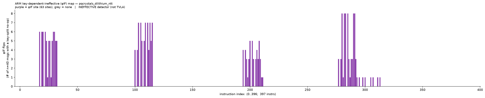

#### `pqcrystals_dilithium_poly_challenge` (φIF)

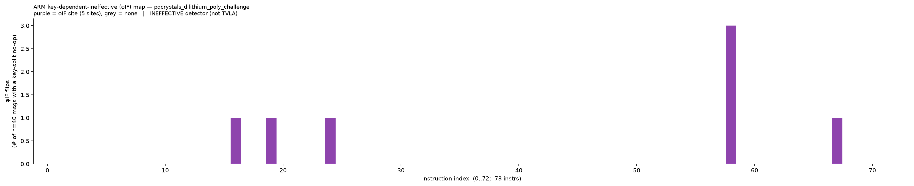

#### `pqcrystals_dilithium_polyvecl_uniform_gamma1` (φIF)

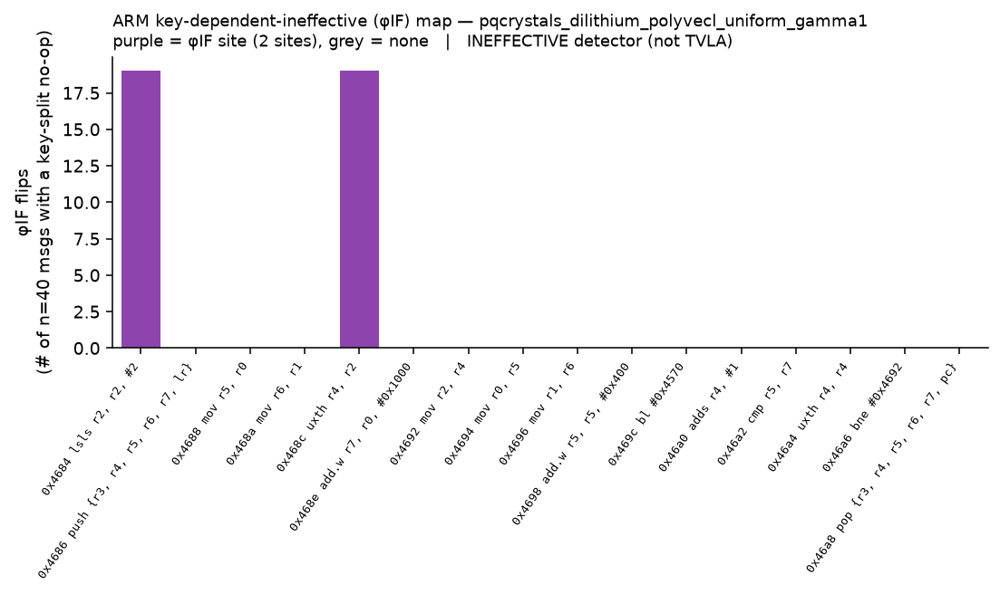

#### `pqcrystals_dilithium_poly_chknorm` (φIF)

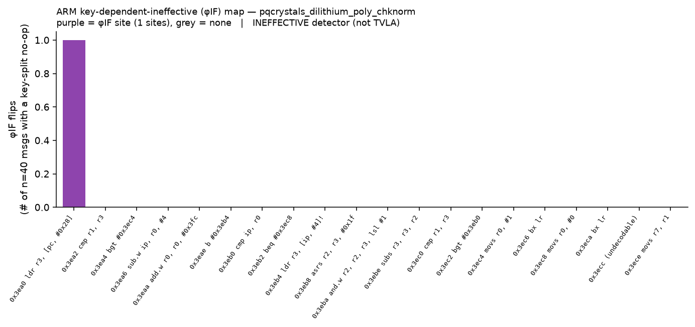

### (A) Distribution-difference / TVLA maps (correction axis, for contrast)

Per-instruction max\|Welch t\| (A vs B), annotated with the function's LLVM-IR tainted-instruction count.
**Red** = LEAK (FDR≤0.01), grey = no leak, light = skip-crash; dashed line = |t|≈4.5 flag threshold.

#### `pqcrystals_dilithium_polyvecl_add` — the key leak (mask add `z=z+y`)

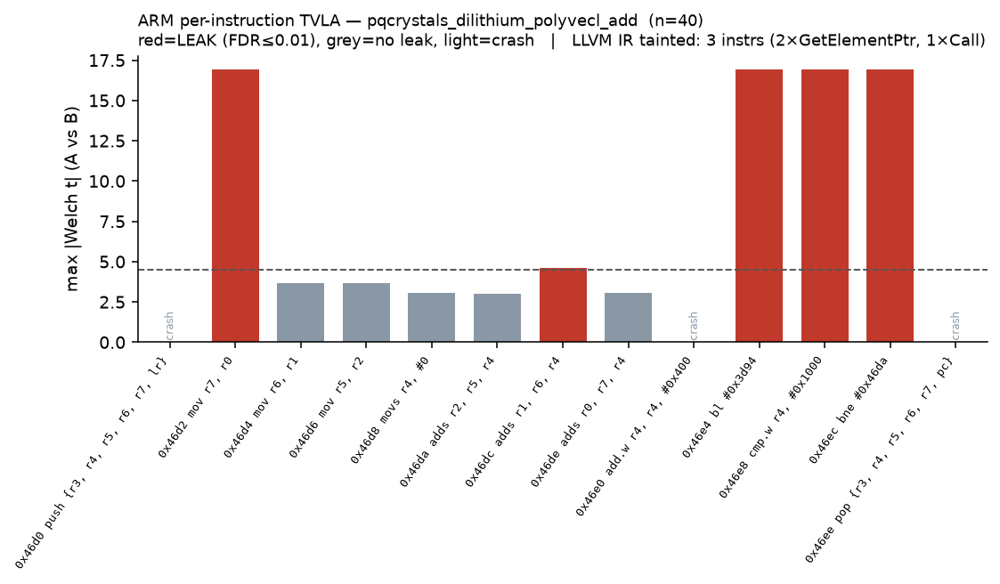

#### `pqcrystals_dilithium_ntt`



#### `pqcrystals_dilithium_invntt_tomont`



#### `pqcrystals_dilithium_poly_uniform`

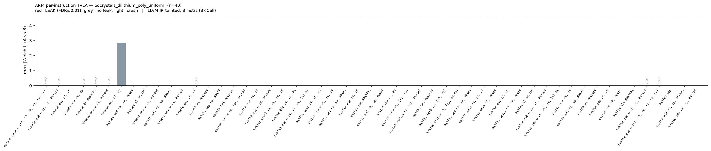

#### `pqcrystals_dilithium_poly_decompose`

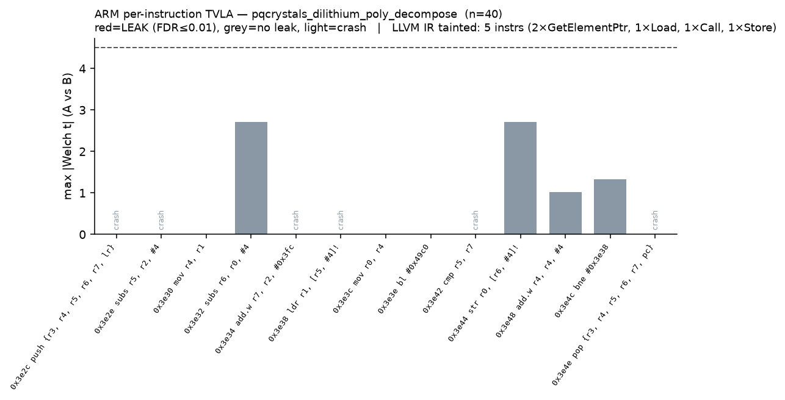

#### `pqcrystals_dilithium_poly_make_hint`

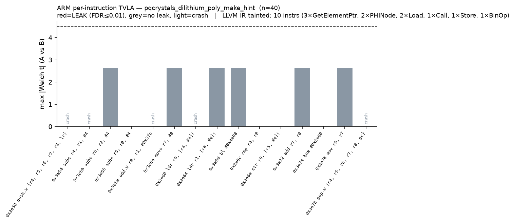

#### `pqcrystals_dilithium_poly_sub`

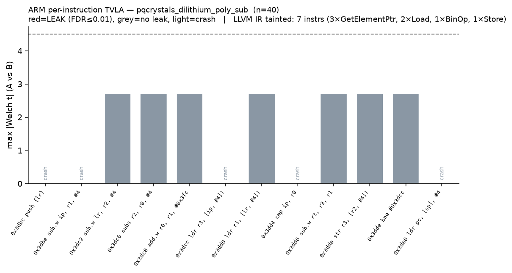

#### `pqcrystals_dilithium_polyvec_matrix_pointwise_montgomery`

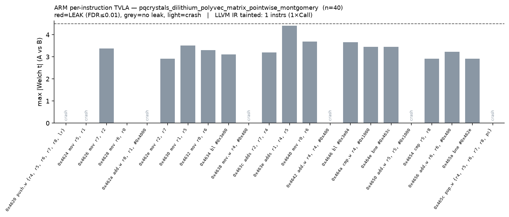

